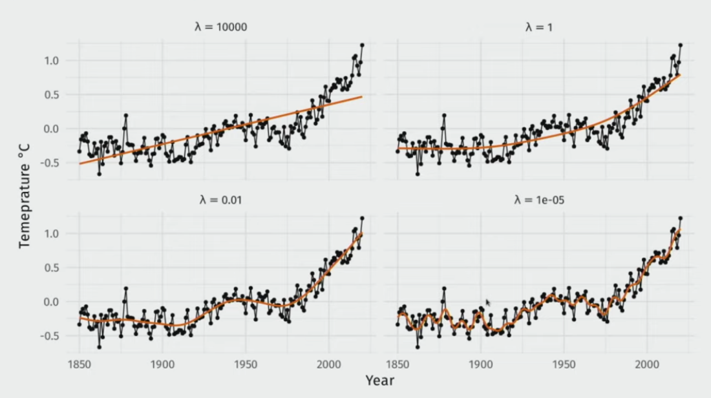

# Regularisation in GAMs

GAMs use a regularisation term $\lambda$ to penalise the 'wiggliness' of a smooth function. For this application, $\lambda$ cannot be directly set via passing in a vector to the gam however, mgcv does support this. Furthermore it is recommended that inexperienced users use the 'REML' method for penalisation estimation although others are offered for experienced users. As such, GAM regularisation will not be covered in depth during this tutorial. This is not to underscore it's importance as estimating $\lambda$ is computationally expensive and critical to preventing overfitting. It is simply trying to maintain an manageable scope for the application and this tutorial.

 

Impact of lambda values on regularisation from https://youtu.be/sgw4cu8hrZM?t=3942 (Simpson, 2020)

### Optimising $\lambda$

For optimising $\lambda$ Simpson (2020) provides a useful comparison between the two recommended methods to use in this application. 

*GCV.cp* is the default method for mgcv for exponential family members and uses generalised cross validation to minimise out of sample error similar to typical cross validation. However, the generalisation means that the cross validation error is estimated rather then explicitly calculated in the interest of reducing fitting time. If the scale parameter is known then Mallows $C_p$ is used otherwise it is simply GCV. This application uses the default scale argument when constructing GAMs, so the Poisson and binomial distributions will have a scale argument of 1 and all else will be unknown. See Wood (2017) p. 258 for more theory.

*REML* is the recommended method due as it's numerical stability (Simpson, 2020; Wood, 2017, p.267-268). It takes a Bayesian approach in which the smooth penalties correspond to a Guassian prior on the basis coefficients and then attempts to maximise the Bayesian log marginal likelihood when selecting the smoothing parameters (Wood, 2017, p.262-263). mgcv offers both REML for estimations with an unknown scale and P-REML if a Pearson estimate of the scale is required. Although mgcv defaults to GCV.cp for exponential family members and REML for others, this application defaults to REML in all cases. This can be changed when building the model.
