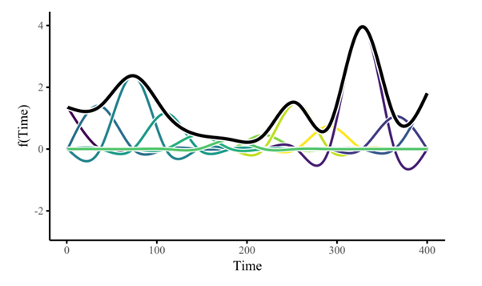

# Generalized Additive Models (GAMs)

GAMs are extensions of GLMs which allow for the use of smooth functions for covariates in the linear predictor (Hastie & Tibshirani, 1986). While GLMs and standard linear models are parametric, the introduction of smooth functions to the linear predictor allow GAMs to use non-parametric terms.

Wood (2017) provides an example structure as follows $g(\mu_i) = A_i \theta + f_1(x_{1i}) + f_2(x_{2i}) + f_3(x_{3i}) + ...$ (Wood, 2017 p. 161). Just as for GLMs, $\mu_i \equiv E(Y_i)$ and $Y_i$ belongs to the exponential family. In the example above, $A_i$ refers to the design matrix for the parametric terms such as those seen in a typical linear model (e.g. $\beta_1 x_1$). $f_j$ refers to the novel component of GAMs which are the smooth functions. 

## Smooths

GAMs are able too model complex wiggly functions using small basis functions which when summed form a smoothing function (spline). These smooth functions allow for much greater flexibility as the value of the covariate can be passed into a non-linear and 'wiggly' function rather then simply being multiplied by a scalar (Lord, 2024). To make use of smoothing functions, the function and a learning method for them must be defined. Observing the image below, we can see an example of a smoothing function and the basis functions that make it.

 (Clark, 2024)

The thick black line is the smoothing function at the given value of the covariate. Each of the smmaller coloured lines represent a basis function. These basis functions may be anchored around a certain value of the covariate known as a knot which will be explained in the next section. The weights of these basis functions are what is learned in order to build the smoothing function as a whole.

The basis functions which create these smooths are what allows GAMs to model complex patterns that are often found in real world systems. However, they are also add complexity for both fitting models and interpreting their outputs.

The next section provides further information for knots and how they are selected which is relevant when building GAMs in this application. Afterwards, we will return to smooths and their components in the context of GAMs.

## Fitting

GAMs in mgcv estimate model coefficients by calculating the penalized maximum likelihood using penalized iteratively re-weighted least squares (PIRLS) (Wood, 2017, p.249). As PIRLS is the only loss function used in this application, it will not be explained during this tutorial in the interest of expediency. Choice of estimation methods for the penalisation terms will be expanded on in the Regularisation section with two main recommendations for use in this application (although more are offered).
